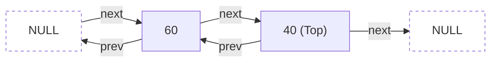
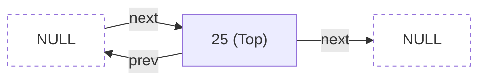
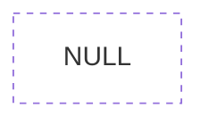
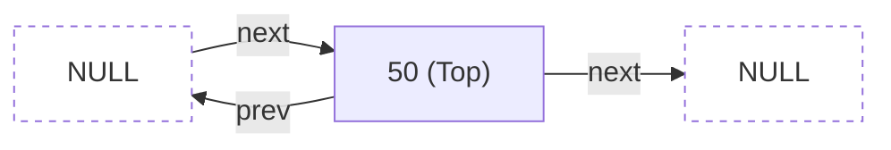
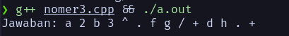
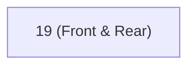
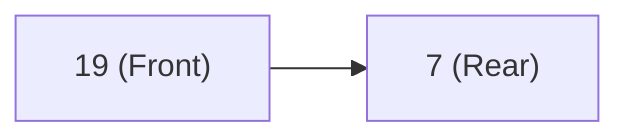
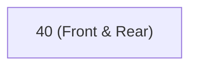
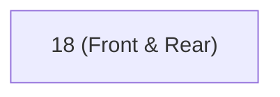
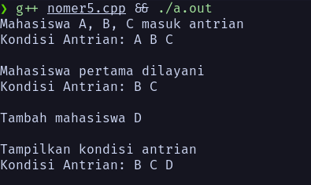

# ETS Struktur Data

Nama: Firsto Al Kautsar Jagad Kurniaji
NRP: 5025251020
Kelas: Struktur Data D

Link Source Code: [Source Code ETS](https://github.com/TsarVib/tugas-matkul-strukdat/tree/main/ets)

---

1. Jelaskan struktur data Array. Digunakan untuk apa Array, Berikan contoh penggunaanya dalam aplikasi.

Jawaban:
Array adalah struktur data untuk menampung kumpulan data primitif (char, int, dll) dalam satu wadah atau variabel.
Contoh: 
Daripada membuat banyak variabel untuk menyatakan nilai mahasiswa:
```cpp
int nilai1 = 90;
int nilai2 = 96;
int nilai3 = 67;
```
Lebih baik menggunakan array:
```cpp
int nilaiMahasiswa[3] = {90, 96, 67};
```

Contoh penggunaan dalam aplikasi:
Misalkan kita ingin membuat aplikasi e-commerce, pasti akan ada fitur menampilkan daftar produk. Misalkan data produk sebagai berikut:
```cpp
struct Produk {
	int id;
	char nama[100];
	float harga;
}
```

Daripada menuliskan kode manual untuk setiap produk, lebih baik kita membuat array dengan tipe data `Produk` dan mengiterasinya:
```cpp
Produk daftarProduk[10] = { /* Data produk */ };
for (int i = 0; i < 10; i++) {
	cout << "Nomor Produk: " << daftarProduk[i].id << endl;
	cout << "Nama Produk: " << daftarProduk[i].nama << endl;
	cout << "Harga Produk: " << daftarProduk[i].harga << endl;
}
```

2. Diketahui Stack berupa Linked List dengan kondisi mula-mula Stack kosong. Gambarkan Stack berupa Double Linked List tersebut beserta posisi penunjuknya (pointer), jika ada perintah:

a. Push(Top,60), Push(Top,40), Pop(Top,Item):

Stack setelah push(top, 60) push(top, 40) 

Stack setelah pop(top, item)


b. Push(Top,25), Pop(Top,Item), Pop(Top,Item):
Stack setelah push(top, 25):

Stack setelah pop(top, item) 2 kali:
Kosong karena isi hanya 1 saat di pop


c. Pop(Top,Item), Pop(Top,Item), Push(Top,50):
Stack setelah pop(top, item) 2 kali:
Kosong karena belum ada isinya

Stack setelah push(top, 50);


3. Diketahui Ekspresi berikut E = a + (2·b^3)/(f − g) + d·h
a. Ubahlah ke dalam notasi Postfix

Jawaban: `a 2 b 3 ^ . f g - / + d h . +`

b. Implementasikan menggunakan Stack dan buat screenshot eksekusinya.
Implementasi Kode:
```cpp
#include <cctype>
#include <iostream>
#include <stack>
#include <string>
using namespace std;

int precedence(char op) {
  if (op == '^')
    return 3;
  else if (op == '.' || op == '/')
    return 2;
  else if (op == '+' || op == '-')
    return 1;
  else
    return 0;
}

bool isOperator(char c) {
  return (c == '+' || c == '-' || c == '.' || c == '/' || c == '^');
}

string infixToPostfix(string infix) {
  stack<char> st;
  string postfix = "";

  for (int i = 0; i < infix.length(); i++) {
    char c = infix[i];

    if (isalnum(c)) {
      postfix += c;
      postfix += " ";
      continue;
    }
    if (c == '(') {
      st.push(c);
      continue;
    }
    if (c == ')') {
      while (!st.empty() && st.top() != '(') {
        postfix += st.top();
        postfix += " ";
        st.pop();
      }
      if (!st.empty())
        st.pop();
      continue;
    }
    if (isOperator(c)) {
      while (!st.empty() && precedence(st.top()) >= precedence(c)) {
        postfix += st.top();
        postfix += " ";
        st.pop();
      }
      st.push(c);
      continue;
    }
  }

  while (!st.empty()) {
    postfix += st.top();
    postfix += " ";
    st.pop();
  }

  return postfix;
}

int main() {
  string infix = "a + (2 . b ^ 3) / (f − g) + d . h";

  cout << "Jawaban: " << infixToPostfix(infix) << endl;
  return 0;
}
```
Output:


4. Diketahui maksimum Queue = 9 elemen dengan kondisi mula-mula Queue kosong. Gambarkan Queue beserta posisi Front dan Rear, jika ada perintah:

a. Tambah Angka 19
Front = 0, Rear = 0

b. Tambah Angka 7
Front = 0, Rear = 1

c. Hapus 2 Angka
Queue menjadi kosong
Front = -1, Rear = -1

d. Tambah Angka 40
Front = 0, Rear = 0

e. Hapus 3 Angka
Queue menjadi kosong
Front = -1, Rear = -1

f. Tambah Angka 18
Front = 0, Rear = 0


5. Soal Studi Kasus di bawah:
## Studi Kasus: Antrian Layanan Akademik
### Deskripsi Masalah
Di sebuah kampus, mahasiswa sering datang ke bagian layanan akademik (misalnya untuk KRS, surat aktif kuliah, atau konsultasi administrasi). Untuk menjaga keteraturan, sistem menggunakan antrian (queue) dengan prinsip:

FIFO (First In First Out) → yang datang lebih dulu, dilayani lebih 
dulu.

Sebuah sistem akademik memiliki fitur:
* Mahasiswa mengambil nomor antrian.
* Petugas melayani mahasiswa berdasarkan urutan.
* Sistem dapat menampilkan antrian saat ini.
* Sistem dapat mengecek siapa yang sedang dilayani.
* Enqueue → Mahasiswa mengambil nomor
* Dequeue → Mahasiswa dipanggil
* Front → Mahasiswa yang sedang dilayani
* Rear → Mahasiswa terakhir dalam antrian
### Pertanyaan
1. Jelaskan bagaimana struktur data queue digunakan dalam sistem ini.
	Jawab: Struktur data queue digunakan dalam sistem antrian akademik dengan menerapkan prinsip FIFO, di mana setiap mahasiswa yang datang akan didaftarkan melalui operasi `enqueue` ke posisi Rear (belakang), dan ketika petugas siap melayani, mahasiswa di posisi Front (depan) akan dipanggil melalui operasi `Dequeue`, sehingga mahasiswa yang datang lebih awal selalu dilayani lebih awal, menjamin keteraturan proses pelayanan akademik.
	
2. Buat algoritma untuk:
	* Menambahkan mahasiswa ke antrian (enqueue)
		```
		Input: karakter a (mewakili mahasiswa)
		
		BEGIN
			// 1. Cek apakah antrian sudah penuh
			IF ((_rear + 1) % 100 == _front)
			THEN
				PRINT "Antrian Penuh!"
				RETURN
			ENDIF
			
			// 2. Jika antrian kosong, inisialisasi _front = 0
			IF (_rear == 1)
			THEN
				_front <- 0
			ENDIF
			
			// 3. geser posisi _rear dan modulo 100 agar antrian sirkular
			_rear <- (_rear + 1) % 100
			// 4. assign value array di index _rear ke value a
			_arr[_rear] <- a
		END
		```
	* Melayani mahasiswa (dequeue)
		```
		BEGIN
		// 1. Cek jika antrian kosong
		IF (_front == -1) THEN
		    PRINT "Antrian Kosong!"
		    RETURN
		ENDIF

		// 2. Kembalikan nilai ke -1 jika antrian kosong
		IF (_front == _rear) THEN
		    _front ← -1
		    _rear  ← -1
		    RETURN
		ENDIF

		// 3. Tambah nilai _front untuk ke mahasiswa berikutnya
		_front ← (_front + 1) % 100
		
		END
		```

3. Implementasikan program sederhana menggunakan bahasa pemrograman (misalnya C++).
Kode:
```cpp
#include <bits/stdc++.h>
using namespace std;

// Sistem Queue Sirkular,
// jika _rear mencapai 100 tapi masih ada tempat di awal array maka akan
// dipakai
struct Queue {
  char _arr[100];
  int _front = -1, _rear = -1;

  // Memasukkan mahasiswa ke antrian
  void enqueue(char a) {
    if ((_rear + 1) % 100 == _front) {
      cout << "Antrian Penuh!" << endl;
      return;
    }

    if (_rear == -1) {
      _front = 0;
    }
    _rear = (_rear + 1) % 100;
    _arr[_rear] = a;
  }

  // Memanggil mahasiswa keluar dari antrian untuk diproses
  void dequeue() {
    if (_front == -1) {
      cout << "Antrian Kosong!" << endl;
      return;
    }
    if (_front == _rear) {
      _front = _rear = -1;
      return;
    }
    _front = (_front + 1) % 100;
  }

  // Untuk melihat depan dan belakang antrian
  char front() { return _arr[_front]; }
  char rear() { return _arr[_rear]; }

  // Mencetak semua anggota antrian
  void printQueue() {
    if (_front == -1) {
      cout << "Antrian Kosong!" << endl;
      return;
    }
    cout << "Kondisi Antrian: ";
    int i = _front;
    while (true) {
      cout << _arr[i] << " ";
      if (i == _rear)
        break;
      i = (i + 1) % 100;
    }
    cout << endl;
  }
};

int main() {
  Queue q;

  cout << "Mahasiswa A, B, C masuk antrian" << endl;
  q.enqueue('A');
  q.enqueue('B');
  q.enqueue('C');
  q.printQueue();
  cout << endl;

  cout << "Mahasiswa pertama dilayani" << endl;
  q.dequeue();
  q.printQueue();
  cout << endl;

  cout << "Tambah mahasiswa D" << endl;
  q.enqueue('D');
  cout << endl;

  cout << "Tampilkan kondisi antrian" << endl;
  q.printQueue();
}
```
4. Simulasikan proses:
	* Mahasiswa A, B, C masuk antrian
	* Mahasiswa pertama dilayani
	* Tambah mahasiswa D
	* Tampilkan kondisi antrian
Kode:
```cpp
// buat main() agar sesuai soal
int main() {
  Queue q;

  cout << "Mahasiswa A, B, C masuk antrian" << endl;
  q.enqueue('A');
  q.enqueue('B');
  q.enqueue('C');
  q.printQueue();
  cout << endl;

  cout << "Mahasiswa pertama dilayani" << endl;
  q.dequeue();
  q.printQueue();
  cout << endl;

  cout << "Tambah mahasiswa D" << endl;
  q.enqueue('D');
  cout << endl;

  cout << "Tampilkan kondisi antrian" << endl;
  q.printQueue();
}
```
Output:

