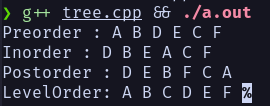

# Tugas 10 (Tree)

Nama: Firsto Al Kautsar Jagad Kurniaji
NRP: 5025251020
Kelas: Struktur Data D

Link Source Code: [Source Code Pertemuan 10](https://github.com/TsarVib/tugas-matkul-strukdat/tree/main/pertemuan-10)

---
1. Rangkuman materi
Tree (Pohon) adalah struktur non-linear berbentuk hierarki yang terdiri dari node (simpul) dan edge (sisi) untuk mengatasi keterbatasan struktur data linear agar penyimpanan dan manipulasi data berskala besar menjadi lebih efisien. Materi ini mencakup pengenalan terminologi anatomi dasar tree seperti root, leaf, parent, dan depth, serta contoh implementasinya dalam teknologi nyata seperti sistem file, HTML DOM, dan pengindeksan basis data. Selain itu, fokus utama lainnya adalah mekanisme traversal (proses mengunjungi setiap node secara sistematis), yang terbagi menjadi dua kategori utama: Depth First Search (DFS) dengan variasi eksekusi Preorder, Inorder, dan Postorder, serta Breadth First Search (BFS) yang menelusuri data secara horizontal per level

2. Implementasi Tree

file tree.cpp

```cpp
#include <iostream>
#include <queue>
using namespace std;

struct Node {
  char data;
  Node *left;
  Node *right;

  Node(char val) {
    data = val;
    left = right = NULL;
  }
};
void preorder(Node *root) {
  if (root == NULL)
    return;

  cout << root->data << " ";
  preorder(root->left);
  preorder(root->right);
}
void inorder(Node *root) {
  if (root == NULL)
    return;

  inorder(root->left);
  cout << root->data << " ";
  inorder(root->right);
}
void postorder(Node *root) {
  if (root == NULL)
    return;

  postorder(root->left);
  postorder(root->right);
  cout << root->data << " ";
}
void levelOrder(Node *root) {
  if (root == NULL)
    return;

  queue<Node *> q;
  q.push(root);

  while (!q.empty()) {
    Node *current = q.front();
    q.pop();

    cout << current->data << " ";

    if (current->left != NULL)
      q.push(current->left);

    if (current->right != NULL)
      q.push(current->right);
  }
}
int main() {
  Node *root = new Node('A');
  root->left = new Node('B');
  root->right = new Node('C');
  root->left->left = new Node('D');
  root->left->right = new Node('E');
  root->right->right = new Node('F');

  cout << "Preorder : ";
  preorder(root);

  cout << "\nInorder : ";
  inorder(root);

  cout << "\nPostorder : ";
  postorder(root);

  cout << "\nLevelOrder: ";
  levelOrder(root);

  return 0;
}
```

Output:


