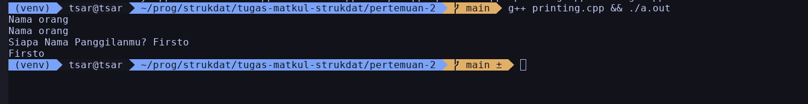
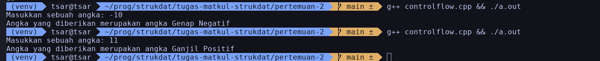
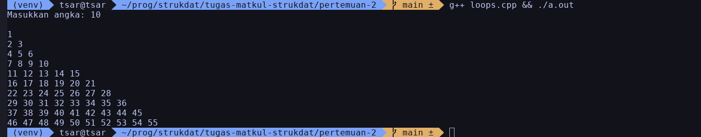
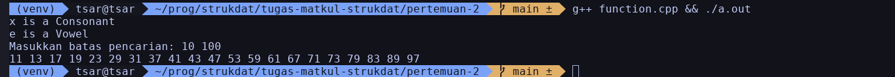
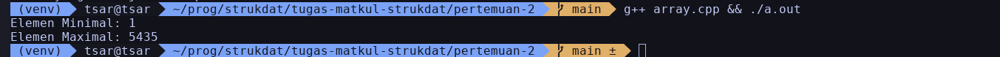
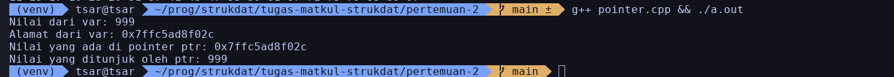
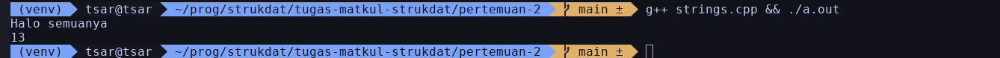

# Dasar-dasar C++ (Pertemuan 2)

Nama: Firsto Al Kautsar Jagad Kurniaji
NRP: 5025251020
Kelas: Struktur Data D

Link Source Code: [Source Code Pertemuan 2](https://github.com/BookShell527/tugas-matkul-strukdat/tree/main/pertemuan-2)

## Printing dan Meminta Input dari User
Membuat variabel ```nama```, meminta nama panggilan dari user, dan mengeluarkannya di terminal.

Kode: 
```cpp
#include <cstdio>
#include <iostream>
using namespace std;

int main() {
  char nama[] = "Nama orang";
  cout << nama << endl;
  puts(nama);

  char name[100];
  cout << "Siapa Nama Panggilanmu? ";
  cin >> name;

  cout << name << endl;

  return 0;
}
```

Output: 


## Control Flow
Meminta angka dari user dan mengklasifikasikan angka tersebut.

Kode:
```cpp
#include <iostream>

using namespace std;

int main() {
  cout << "Masukkan sebuah angka: ";
  int angka;
  cin >> angka;

  cout << "Angka yang diberikan merupakan angka ";
  if (angka % 2 == 0) {
    cout << "Genap ";
  } else {
    cout << "Ganjil ";
  }

  if (angka < 0) {
    cout << "Negatif";
  } else if (angka > 0) {
    cout << "Positif";
  }

  cout << endl;
  return 0;
}
```

Output:


## Loop
Meminta variabel ```n``` dari user dan mengeluarkan pola dengan ```n```-baris

Kode:
```cpp
#include <iostream>
using namespace std;

int main() {
  int r, c, num = 1, n = 5;
  cout << "Masukkan angka: ";
  cin >> n;
  for (r = 0; r <= n; r++) {
    for (c = 0; c < r; c++) {
      cout << num++ << " ";
    }
    cout << "\n";
  }
  return 0;
}
```

Output:


## Function
Membuat fungsi untuk klasifikasi character dan menemukan angka prima di rentang tertentu.

Kode:
```cpp
#include <bits/stdc++.h>
#include <cctype>
using namespace std;

void vowelOrConsonant(char x) {
  char a = tolower(x);
  if (a == 'a' || a == 'i' || a == 'u' || a == 'e' || a == 'o')
    cout << x << " is a Vowel" << endl;
  else
    cout << x << " is a Consonant" << endl;
}

bool isPrime(int x) {
  if (x <= 1) {
    return false;
  }
  for (int i = 2; i * i <= x; i++) {
    if (x % i == 0) {
      return false;
    }
  }
  return true;
}

void findPrime(int l, int r) {
  if (l > r) {
    int t = l;
    l = r;
    r = t;
  }
  bool found = false;
  for (int i = l; i <= r; i++) {
    if (isPrime(i)) {
      cout << i << " ";
      found = true;
    }
  }
  cout << endl;

  if (!found) {
    cout << "Tidak ada angka prima yang ditemukan" << endl;
  }
}

int main() {
  char a = 'x', b = 'e';
  vowelOrConsonant(a);
  vowelOrConsonant(b);
  cout << "Masukkan batas pencarian: ";
  int l, r;
  cin >> l >> r;
  findPrime(l, r);

  return 0;
}
```

Output:


## Array
Membuat array dan menampilkan elemen terkecil dan terbesarnya.

Kode:
```cpp
#include <bits/stdc++.h>

using namespace std;

int getMin(int arr[], int n) {
  if (n == 0) {
    return 0;
  }
  int res = arr[0];
  for (int i = 1; i < n; i++) {
    res = min(res, arr[i]);
  }
  return res;
}
int getMax(int arr[], int n) {
  if (n == 0) {
    return 0;
  }
  int res = arr[0];
  for (int i = 1; i < n; i++) {
    res = max(res, arr[i]);
  }
  return res;
}

int main() {
  int arr[] = {12, 3213, 43, 5435, 65, 1, 213};
  int n = sizeof(arr) / sizeof(int);
  cout << "Elemen Minimal: " << getMin(arr, n) << endl;
  cout << "Elemen Maximal: " << getMax(arr, n) << endl;
  return 0;
}
```

Output:


## Pointer
Membuat variabel ```var``` dan mengeluarkan alamat serta nilainya dengan pointer.

Kode:
```cpp
#include <bits/stdc++.h>
using namespace std;

int main() {
  int var = 999;
  int *ptr = &var;
  cout << "Nilai dari var: " << var << endl;
  cout << "Alamat dari var: " << &var << endl;
  cout << "Nilai yang ada di pointer ptr: " << ptr << endl;
  cout << "Nilai yang ditunjuk oleh ptr: " << *ptr << endl;

  return 0;
}
```

Output:


## String
Membuat string dengan library c++ ```<string>```.

Kode:
```cpp
#include <iostream>
#include <string>

using namespace std;

int main() {
  string str = "Halo semuanya";
  cout << str << endl;
  cout << str.size() << endl;
}
```

Output:


