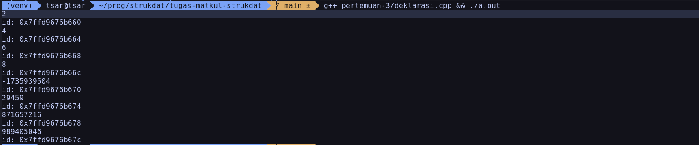
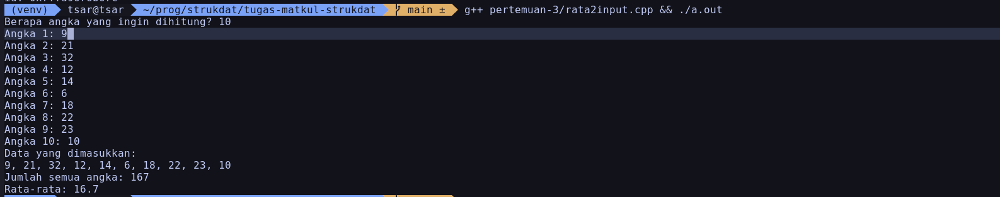
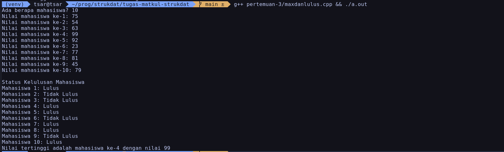
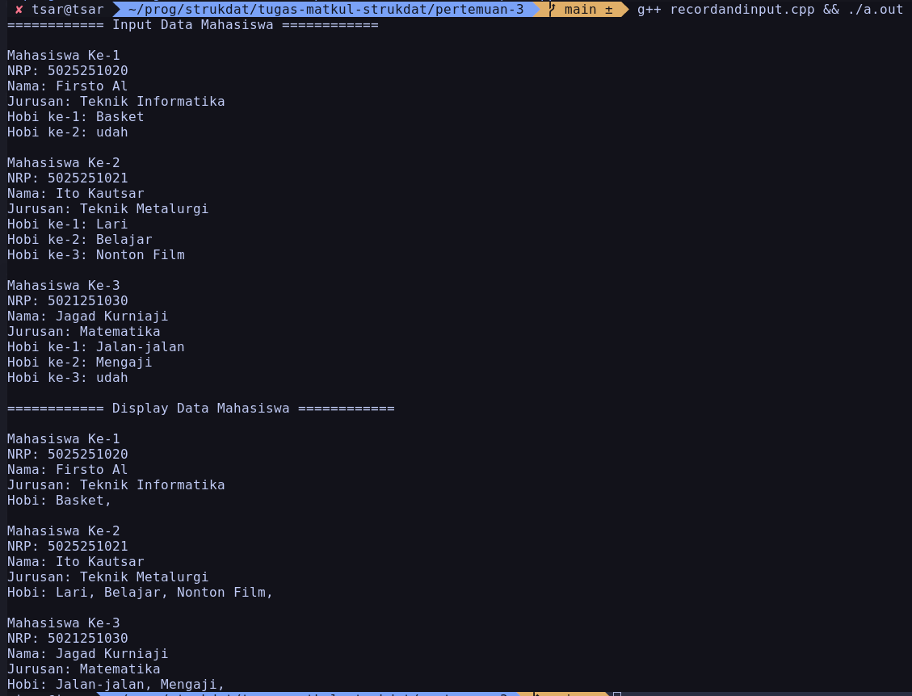

# Tipe Data Array (Pertemuan 3)

Nama: Firsto Al Kautsar Jagad Kurniaji
NRP: 5025251020
Kelas: Struktur Data D

Link Source Code: [Source Code Pertemuan 3](https://github.com/BookShell527/tugas-matkul-strukdat/tree/main/pertemuan-3)

## Deklarasi dan Akses Anggota Array
1. Mendeklarasikan array bilangan bulat
2. Mengakses anggotanya dengan iterasi for loop 
3. Menampilkan nilai beserta addressnya di terminal.

Kode:
```cpp
#include <bits/stdc++.h>
using namespace std;

int main() {
  int arr[] = {2, 4, 6, 8};
  for (int i = 0; i < 8; i++) {
    cout << arr[i] << endl;
    cout << "id: " << &arr[i] << endl;
  }
  return 0;
}
```

Output:


## Rata-Rata Anggota Array
1. Meminta input beberapa bilangan bulat dari user.
2. Memasukkannya ke array.
3. Menghitung rata-ratanya.
4. Menampilkannya di terminal.

Kode: 
```cpp
#include <bits/stdc++.h>
using namespace std;

int main() {
  int n;
  cout << "Berapa angka yang ingin dihitung? ";
  cin >> n;

  int number[n];
  int total = 0;
  float rata2;
  for (int i = 0; i < n; i++) {
    cout << "Angka " << i + 1 << ": ";
    cin >> number[i];
    total += number[i];
  }

  rata2 = total / (float)n;

  cout << "Data yang dimasukkan: " << endl;
  for (int i = 0; i < n; i++) {
    cout << number[i];
    if (i != n - 1)
      cout << ", ";
  }
  cout << "\n";

  cout << "Jumlah semua angka: " << total << "\n";
  cout << "Rata-rata: " << rata2 << "\n";

  return 0;
}
```

Output: 


## Mencari Max dan Menentukan Kelulusan
1. Meminta input beberapa nilai mahasiswa
2. Memasukkannya ke array 
3. Mencari nilai terbesar dari array
4. Menampilkan status kelulusan dengan syarat nilai >= 75

Kode:
```cpp
#include <bits/stdc++.h>
using namespace std;

int main() {
  int n;
  cout << "Ada berapa mahasiswa? ";
  cin >> n;
  int nilai[n];
  int maxNilai = -9999;
  int bestMhs = -9999;

  for (int i = 0; i < n; i++) {
    cout << "Nilai mahasiswa ke-" << i + 1 << ": ";
    cin >> nilai[i];
    if (nilai[i] > maxNilai) {
      maxNilai = nilai[i];
      bestMhs = i + 1;
    }
  }

  cout << "\nStatus Kelulusan Mahasiswa\n";
  for (int i = 0; i < n; i++) {
    cout << "Mahasiswa " << i + 1 << ": ";
    if (nilai[i] < 75) {
      cout << "Tidak ";
    }
    cout << "Lulus\n";
  }

  cout << "Nilai tertinggi adalah mahasiswa ke-" << bestMhs << " dengan nilai "
       << maxNilai << "\n";

  return 0;
}
```

Output: 


## Array yang Berisi Record
1. Membuat record Mahasiswa yang berisi nrp, nama, jurusan, dan daftar hobi (mahasiswa dapat memasukkan maksimal 3 hobi).
2. Meminta input data 3 mahasiswa dari user.
3. Menampilkan data semua mahasiswa.

Kode:
```cpp
#include <bits/stdc++.h>
using namespace std;

struct Mahasiswa {
  string nrp, nama, jurusan, hobi[3];
};

int main() {
  Mahasiswa mhs[3];

  // Meminta data mahasiswa dari User;
  cout << "============ Input Data Mahasiswa ============" << endl;
  for (int i = 0; i < 3; i++) {
    cout << "\nMahasiswa Ke-" << i + 1 << endl;

    cout << "NRP: ";
    getline(cin, mhs[i].nrp);

    cout << "Nama: ";
    getline(cin, mhs[i].nama);

    cout << "Jurusan: ";
    getline(cin, mhs[i].jurusan);

    for (int j = 0; j < 3; j++) {
      cout << "Hobi ke-" << j + 1 << ": ";
      getline(cin, mhs[i].hobi[j]);
      // berhenti kalau user memasukkan "udah"
      if (mhs[i].hobi[j].compare("udah") == 0)
        break;
    }
  }
  cout << endl;

  // Display data-data mahasiswa
  cout << "============ Display Data Mahasiswa ============" << endl;
  for (int i = 0; i < 3; i++) {
    cout << "\nMahasiswa Ke-" << i + 1 << endl;
    cout << "NRP: " << mhs[i].nrp << endl;
    cout << "Nama: " << mhs[i].nama << endl;
    cout << "Jurusan: " << mhs[i].jurusan << endl;
    cout << "Hobi: ";
    for (int j = 0; j < 3; j++) {
      // berhenti kalau hobi mahasiswa adalah "udah"
      if (mhs[i].hobi[j].compare("udah") == 0)
        break;
      cout << mhs[i].hobi[j] << ", ";
    }
    cout << endl;
  }

  return 0;
}
```

Output:


