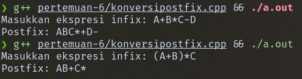
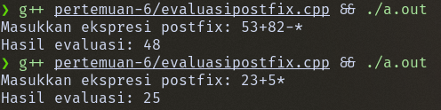
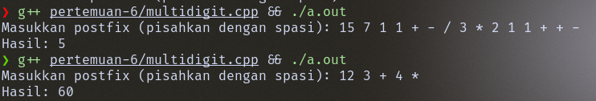

# Aplikasi Penggunaan Stack (Pertemuan 6)

Nama: Firsto Al Kautsar Jagad Kurniaji
NRP: 5025251020
Kelas: Struktur Data D

Link Source Code: [Source Code Pertemuan 6](https://github.com/TsarVib/tugas-matkul-strukdat/tree/main/pertemuan-6)

---

## Konversi Notasi Infix ke Postfix

### Kode

```cpp
bool isOperator(char c) {
  return (c == '+' || c == '-' || c == '/' || c == '^' || c == '*');
}

// Menentukan prioritas operator matematika
int precedence(char c) {
  switch (c) {
  case '^':
    return 3;
  case '*':
  case '/':
    return 2;
  case '+':
  case '-':
    return 1;
  default:
    return 0;
  }
}

// Merubah notasi infix -> posfix
string infixToPostfix(string infix) {
  stack<char> st;
  string res = "";

  for (int i = 0; i < infix.length(); i++) {
    char c = infix[i];
    if (isalnum(c)) {
      res += c;
      continue;
    }
    if (c == '(') {
      st.push(c);
      continue;
    }

    if (c == ')') {
      while (!st.empty() && st.top() != '(') {
        res += st.top();
        st.pop();
      }
      if (!st.empty())
        st.pop();
      continue;
    }

    if (isOperator(c)) {
      while (!st.empty() && precedence(st.top()) >= precedence(c)) {
        res += st.top();
        st.pop();
      }
      st.push(c);
    }
  }
  while (!st.empty()) {
    res += st.top();
    st.pop();
  }

  return res;
}

int main() {
  string infix;
  cout << "Masukkan ekspresi infix: ";
  cin >> infix;

  string postfix = infixToPostfix(infix);
  cout << "Postfix: " << postfix << endl;
  return 0;
}
```

### Output



### Visualisasi
Contoh Input: `A+B*C-D`

| Baca | Aksi | Stack | Hasil |
|------|------|-------|-------|
| `A` | Operand → langsung ke hasil | `[]` | `A` |
| `+` | Stack kosong → push | `[+]` | `A` |
| `B` | Operand → langsung ke hasil | `[+]` | `AB` |
| `*` | Prioritas `*` > `+` → push | `[+, *]` | `AB` |
| `C` | Operand → langsung ke hasil | `[+, *]` | `ABC` |
| `-` | Prioritas `-` ≤ `*` → pop `*` | `[+]` | `ABC*` |
| `-` | Prioritas `-` ≤ `+` → pop `+` | `[]` | `ABC*+` |
| `-` | Push `-` | `[-]` | `ABC*+` |
| `D` | Operand → langsung ke hasil | `[-]` | `ABC*+D` |
| (end) | Keluarkan sisa stack | `[]` | `ABC*+D-` |

Hasil akhir: ABC*+D-

## Evaluasi Notasi Postfix Single Digit

### Kode
```cpp
int evaluatePostfix(string exp) {
  stack<int> st;

  for (char c : exp) {
    if (isdigit(c)) {
      st.push(c - '0');
      continue;
    }
    int val2 = st.top();
    st.pop();
    int val1 = st.top();
    st.pop();

    switch (c) {
    case '+':
      st.push(val1 + val2);
      break;
    case '-':
      st.push(val1 - val2);
      break;
    case '*':
      st.push(val1 * val2);
      break;
    case '/':
      st.push(val1 / val2);
      break;
    }
  }

  return st.top();
}

int main() {
  string postfix;

  cout << "Masukkan ekspresi postfix: ";
  cin >> postfix;

  cout << "Hasil evaluasi: " << evaluatePostfix(postfix) << endl;

  return 0;
}
```

### Output



### Visualisasi

Contoh Input: `53+82-*`

| Baca | Aksi | Stack |
|------|------|-------|
| `5` | Angka → push | `[5]` |
| `3` | Angka → push | `[5, 3]` |
| `+` | Pop 3 (val2), pop 5 (val1) → 5+3=8 → push | `[8]` |
| `8` | Angka → push | `[8, 8]` |
| `2` | Angka → push | `[8, 8, 2]` |
| `-` | Pop 2 (val2), pop 8 (val1) → 8-2=6 → push | `[8, 6]` |
| `*` | Pop 6 (val2), pop 8 (val1) → 8\*6=48 → push | `[48]` |

Hasil akhir: `48`

## Evaluasi Notasi Postfix Multi Digit

### Kode
```cpp
bool isOperator(string token) {
  return (token == "+" || token == "-" || token == "*" || token == "/" ||
          token == "^");
}

int evaluatePostfix(string exp) {
  stack<int> st;
  stringstream ss(exp);
  string token;

  while (ss >> token) {
    if (!isOperator(token)) {
      st.push(stoi(token));
      continue;
    }
    int val2 = st.top();
    st.pop();
    int val1 = st.top();
    st.pop();

    if (token == "+")
      st.push(val1 + val2);
    else if (token == "-")
      st.push(val1 - val2);
    else if (token == "*")
      st.push(val1 * val2);
    else if (token == "/")
      st.push(val1 / val2);
    else if (token == "^")
      st.push(pow(val1, val2));
  }

  return st.top();
}

int main() {
  string postfix;

  cout << "Masukkan postfix (pisahkan dengan spasi): ";
  getline(cin, postfix);

  cout << "Hasil: " << evaluatePostfix(postfix) << endl;

  return 0;
}
```

### Output



### Visualisasi

Contoh Input: `15 7 1 1 + - / 3 * 2 1 1 + + -`

| Token | Aksi | Stack |
|-------|------|-------|
| `15` | Angka → push | `[15]` |
| `7` | Angka → push | `[15, 7]` |
| `1` | Angka → push | `[15, 7, 1]` |
| `1` | Angka → push | `[15, 7, 1, 1]` |
| `+` | 1+1=2 → push | `[15, 7, 2]` |
| `-` | 7-2=5 → push | `[15, 5]` |
| `/` | 15/5=3 → push | `[3]` |
| `3` | Angka → push | `[3, 3]` |
| `*` | 3\*3=9 → push | `[9]` |
| `2` | Angka → push | `[9, 2]` |
| `1` | Angka → push | `[9, 2, 1]` |
| `1` | Angka → push | `[9, 2, 1, 1]` |
| `+` | 1+1=2 → push | `[9, 2, 2]` |
| `+` | 2+2=4 → push | `[9, 4]` |
| `-` | 9-4=5 → push | `[5]` |

Hasil akhir: 5
