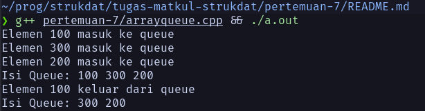
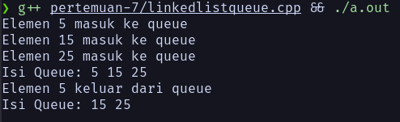

# Struktur Data Queue (Pertemuan 7)

Nama: Firsto Al Kautsar Jagad Kurniaji
NRP: 5025251020
Kelas: Struktur Data D

Link Source Code: [Source Code Pertemuan 7](https://github.com/TsarVib/tugas-matkul-strukdat/tree/main/pertemuan-7)

---

## Apa Itu Queue?

Queue adalah struktur data linear yang bekerja dengan prinsip **FIFO - First In, First Out**. Data yang pertama masuk, akan pertama keluar. Queue punya dua ujung: *front* (depan) untuk mengambil data, dan *rear* (belakang) untuk memasukkan data baru.


---

## Contoh Penggunaan

- Antrian nasabah di bank
- Print queue (daftar dokumen yang menunggu dicetak)
- Task scheduling di sistem operasi
- Jalan satu jalur — kendaraan masuk pertama, keluar pertama

---

## Operasi Utama

| Operasi | Keterangan |
|---|---|
| `enqueue()` | Tambah data ke bagian belakang (rear) |
| `dequeue()` | Hapus data dari bagian depan (front) |

---

## Algoritma Enqueue

Enqueue adalah proses memasukkan data ke bagian belakang (rear) queue. Kalau queue sudah penuh, proses ini akan menghasilkan kondisi *overflow* — tidak bisa diisi lagi.

```
ALGORITHM Enqueue(Q, item)

BEGIN
    IF rear = MAX - 1 THEN
        OUTPUT "Queue Overflow"
        RETURN
    ENDIF

    IF front = -1 THEN
        front ← 0
        rear  ← 0
    ELSE
        rear ← rear + 1
    ENDIF

    Q[rear] ← item
END
```

### Penjelasan Variabel

| Variabel | Keterangan |
|---|---|
| `Q` | Array sebagai tempat penyimpanan queue |
| `MAX` | Kapasitas maksimum queue |
| `front` | Penunjuk posisi elemen paling depan |
| `rear` | Penunjuk posisi elemen paling belakang |
| `item` | Data yang akan dimasukkan |

---

## Algoritma Dequeue

Dequeue adalah proses mengambil dan menghapus data dari bagian depan (front) queue. Kalau queue sudah kosong dan dipaksa dequeue, akan muncul kondisi *underflow*.

```
ALGORITHM Dequeue(Q)

BEGIN
    IF front = -1 THEN
        OUTPUT "Queue Underflow"
        RETURN
    ENDIF

    item ← Q[front]

    IF front = rear THEN
        front ← -1
        rear  ← -1
    ELSE
        front ← front + 1
    ENDIF

    RETURN item
END
```

---

## Implementasi dengan Array (C++)

Cara paling sederhana mengimplementasikan queue adalah menggunakan array statis. Ukurannya tetap dan ditentukan di awal (`MAX = 5`).

Kode: 
```cpp
#include <iostream>
using namespace std;

#define MAX 5

class Queue {
private:
    int arr[MAX];
    int front, rear;

public:
    Queue() {
        front = -1;
        rear = -1;
    }

    bool isEmpty() {
        return (front == -1);
    }

    bool isFull() {
        return (rear == MAX - 1);
    }

    void enqueue(int x) {
        if (isFull()) {
            cout << "Queue Overflow\n";
            return;
        }
        if (isEmpty()) {
            front = 0;
        }
        arr[++rear] = x;
        cout << "Elemen " << x << " masuk ke queue\n";
    }

    void dequeue() {
        if (isEmpty()) {
            cout << "Queue Underflow\n";
            return;
        }
        cout << "Elemen " << arr[front] << " keluar dari queue\n";
        if (front == rear) {
            front = rear = -1;
        } else {
            front++;
        }
    }

    void display() {
        if (isEmpty()) {
            cout << "Queue kosong\n";
            return;
        }
        cout << "Isi Queue: ";
        for (int i = front; i <= rear; i++) {
            cout << arr[i] << " ";
        }
        cout << endl;
    }
};

int main() {
    Queue q;

    q.enqueue(10);
    q.enqueue(20);
    q.enqueue(30);

    q.display();

    q.dequeue();
    q.display();

    return 0;
}
```
Output:


> **Kelebihan & Kekurangan**
> Implementasi array mudah dipahami dan cepat diakses. Tapi ukurannya tidak fleksibel — kalau data melebihi `MAX`, tidak bisa ditambah lagi. Solusinya? Pakai linked list.

---

## Implementasi dengan Linked List (C++)

Kalau pakai linked list, ukuran queue bisa berkembang secara dinamis sesuai kebutuhan. Tidak perlu khawatir soal batas kapasitas (selama memori masih ada).

Kode: 
```cpp
#include <iostream>
using namespace std;

struct Node {
    int data;
    Node* next;
};

class Queue {
private:
    Node *front, *rear;

public:
    Queue() {
        front = rear = NULL;
    }

    bool isEmpty() {
        return (front == NULL);
    }

    void enqueue(int x) {
        Node* newNode = new Node();
        newNode->data = x;
        newNode->next = NULL;

        if (rear == NULL) {
            front = rear = newNode;
        } else {
            rear->next = newNode;
            rear = newNode;
        }
        cout << "Elemen " << x << " masuk ke queue\n";
    }

    void dequeue() {
        if (isEmpty()) {
            cout << "Queue kosong\n";
            return;
        }

        Node* temp = front;
        cout << "Elemen " << temp->data << " keluar dari queue\n";

        front = front->next;

        if (front == NULL) {
            rear = NULL;
        }

        delete temp;
    }

    void display() {
        if (isEmpty()) {
            cout << "Queue kosong\n";
            return;
        }

        Node* temp = front;
        cout << "Isi Queue: ";
        while (temp != NULL) {
            cout << temp->data << " ";
            temp = temp->next;
        }
        cout << endl;
    }
};

int main() {
    Queue q;

    q.enqueue(5);
    q.enqueue(15);
    q.enqueue(25);

    q.display();

    q.dequeue();
    q.display();

    return 0;
}
```

Output:


---

## Ringkasan

Queue adalah struktur data antrian dengan prinsip FIFO. Data masuk dari belakang (*enqueue*) dan keluar dari depan (*dequeue*). Ada dua cara implementasinya di C++:

| | Array | Linked List |
|---|---|---|
| Ukuran | Tetap (statis) | Dinamis |
| Kompleksitas | Lebih sederhana | Sedikit lebih kompleks |
| Cocok untuk | Data terbatas & sudah diketahui | Data yang jumlahnya tidak pasti |
