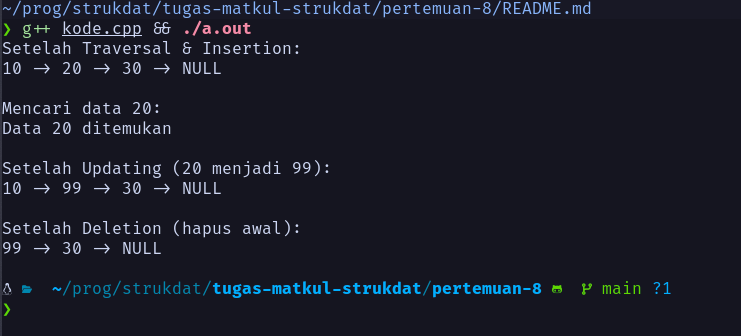

# Dokumentasi Tugas 8 - Linked List

Nama: Firsto Al Kautsar Jagad Kurniaji
NRP: 5025251020
Kelas: Struktur Data D

Link Source Code: [Source Code Pertemuan 8](https://github.com/TsarVib/tugas-matkul-strukdat/tree/main/pertemuan-8)

## Struktur Node dan Implementasi Dasar**
```cpp
using namespace std;

// Struktur Node
struct Node { 
    int data; 
    Node* next; 
};

int main() { 
    // Membuat 3 node 
    Node* node1 = new Node(); 
    Node* node2 = new Node(); 
    Node* node3 = new Node();

    // Isi data 
    node1->data = 10; 
    node2->data = 20; 
    node3->data = 30;

    // Hubungkan node 
    node1->next = node2; 
    node2->next = node3;
    node3->next = NULL;

    // Traversal (menampilkan data) 
    Node* current = node1; 
    while (current != NULL) { 
        cout << current->data << " -> "; 
        current = current->next; 
    } 
    cout << "NULL";

    return 0; 
}
```

## Operasi Traversal
```cpp
Node* current = head; 
while (current != NULL) {     
    cout << current->data << " ";     
    current = current->next; 
}
```

## Operasi Insertion (di awal)
```cpp
Node* newNode = new Node(); 
newNode->data = 10; 
newNode->next = head; 
head = newNode;
```

## Operasi Deletion (di awal)
```cpp
Node* temp = head; 
head = head->next; 
delete temp;
```

## Operasi Searching
```cpp
Node* current = head; 
while (current != NULL) {     
    if (current->data == key) {         
        cout << "Data ditemukan";         
        break;     
    }     
    current = current->next; 
}
```

## Operasi Updating
```cpp
Node* current = head; 
while (current != NULL) {     
    if (current->data == 10) {         
        current->data = 100;     
    }     
    current = current->next; 
}
```

## Kode Full
```cpp
#include <iostream>
using namespace std;

struct Node {
  int data;
  Node *next;
};

struct LinkedList {
  Node *head = NULL;

  void insertNode(int value) {
    Node *newNode = new Node();
    newNode->data = value;
    newNode->next = head;
    head = newNode;
  }

  void traverseList() {
    Node *current = head;
    while (current != NULL) {
      cout << current->data << " -> ";
      current = current->next;
    }
    cout << "NULL\n";
  }

  void deleteNode() {
    if (head != NULL) {
      Node *temp = head;
      head = head->next;
      delete temp;
    }
  }

  void searchNode(int key) {
    Node *current = head;
    while (current != NULL) {
      if (current->data == key) {
        cout << "Data " << key << " ditemukan\n";
        return;
      }
      current = current->next;
    }
    cout << "Data " << key << " tidak ditemukan\n";
  }

  void updateNode(int oldValue, int newValue) {
    Node *current = head;
    while (current != NULL) {
      if (current->data == oldValue) {
        current->data = newValue;
      }
      current = current->next;
    }
  }
};

int main() {
  LinkedList list;

  list.insertNode(30);
  list.insertNode(20);
  list.insertNode(10);

  cout << "Setelah Traversal & Insertion:\n";
  list.traverseList();

  cout << "\nMencari data 20:\n";
  list.searchNode(20);

  cout << "\nSetelah Updating (20 menjadi 99):\n";
  list.updateNode(20, 99);
  list.traverseList();

  cout << "\nSetelah Deletion (hapus awal):\n";
  list.deleteNode();
  list.traverseList();

  return 0;
}
```

Output: 


